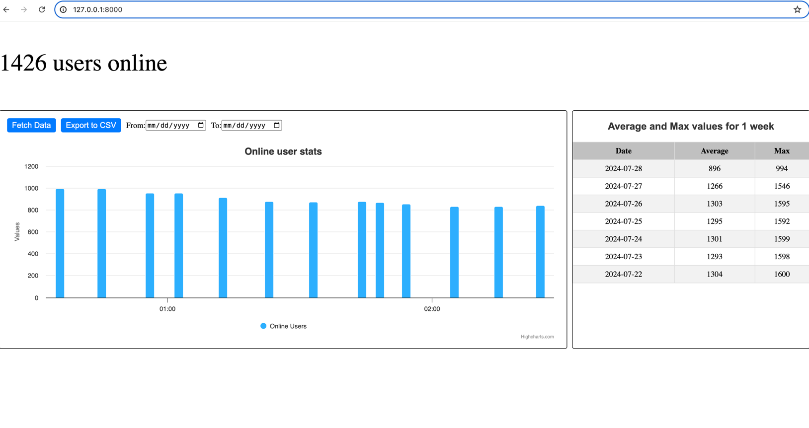

# Laravel Project

## Introduction
This is a Laravel project designed to demonstrate various features and functionalities. Follow the steps below to set up and run the project on your local machine.

## Prerequisites
- [Docker](https://www.docker.com/get-started) installed
- [Composer](https://getcomposer.org/download/) installed
- [Node.js](https://nodejs.org/en/download/) installed

## Getting Started

### Step 1: Clone the Repository
First, clone the repository from GitHub.

```bash
git clone https://github.com/svetlakoviv/gamefam.git
cd gamefam
```


### Step 2: Start the Docker Environment
Use Laravel Sail to start the Docker environment.
```bash
./vendor/bin/sail up
```

### Step 3: Create and Configure the .env File
Create a .env file by copying the .env.example file and fill in the necessary environment variables.
```bash
cp .env.example .env
```
Edit the .env file and configure the database and other necessary settings.

### Step 4: Install Dependencies
Install the necessary PHP dependencies using Composer.
```bash
composer install
```

### Step 5: Run Migrations and Seeders
Run the database migrations to set up the database schema and seed the database with initial data, if needed.
If you have php installed you may use `php artisan` instead of `./vendor/bin/sail artisan`, but you need to be sure that all hosts are correctly set up in .env file.
```bash
./vendor/bin/sail artisan migrate
./vendor/bin/sail artisan db:seed --class=UserStatsTableSeeder
```

### Step 6: Run Scheduler and Frontend
Start the Laravel scheduler and the frontend build process.
```bash
./vendor/bin/sail artisan schedule:work
./vendor/bin/sail artisan serve
npm install
npm run dev
```

If everything is working the site should look like this:


### Additional Commands
Run Tests:
```bash
./vendor/bin/sail artisan test
```
Clear Cache:
```bash
./vendor/bin/sail artisan cache:clear
```

For any questions or concerns, please reach out to svetlakoviv@gmail.com
